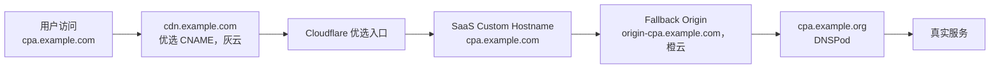

# Cloudflare 与相关服务文档合集

> **整理来源**:Codex 会话备份(`conversations-backup-XXXXXXXX-175919`)
> **整理日期**:2026-08-12
>
> 本合集整合了 4 个历史会话,覆盖:Cloudflare 优选域名配置、访问慢排查、Tunnel/Turnstile 接入、EMOS Emby 服务器访问。

## 📑 目录

- [1. 核心结论速览](#1-核心结论速览)
- [2. Cloudflare 优选域名配置](#2-cloudflare-优选域名配置)
  - [2.1 背景](#21-背景)
  - [2.2 方案演进](#22-方案演进)
  - [2.3 域名分工](#23-域名分工)
  - [2.4 访问链路](#24-访问链路)
  - [2.5 完整部署流程](#25-完整部署流程)
  - [2.6 故障判断](#26-故障判断)
  - [2.7 关键注意事项](#27-关键注意事项)
- [3. Cloudflare 访问慢与 Turnstile 验证排查](#3-cloudflare-访问慢与-turnstile-验证排查)
  - [3.1 现象与结论](#31-现象与结论)
  - [3.2 排查顺序](#32-排查顺序)
  - [3.3 实测结果解读](#33-实测结果解读)
  - [3.4 处理步骤与测速](#34-处理步骤与测速)
- [4. Cloudflare Tunnel 与 Turnstile 接入](#4-cloudflare-tunnel-与-turnstile-接入)
  - [4.1 Cloudflare Tunnel(内网穿透)](#41-cloudflare-tunnel内网穿透)
  - [4.2 CNAME 接入说明](#42-cname-接入说明)
  - [4.3 Cloudflare Turnstile(人机验证码)](#43-cloudflare-turnstile人机验证码)
  - [4.4 结论速查](#44-结论速查)
- [5. EMOS Emby 服务器访问](#5-emos-emby-服务器访问)
  - [5.1 接入方法](#51-接入方法)
  - [5.2 直连测试结果](#52-直连测试结果)
  - [5.3 Clash 直连规则](#53-clash-直连规则)
  - [5.4 萝卜(Carrot)规则](#54-萝卜carrot规则)
- [6. 真实性与可行性核对(2026-08-12)](#6-真实性与可行性核对2026-08-12)
  - [6.1 核对方法](#61-核对方法)
  - [6.2 逐条核对结果](#62-逐条核对结果)
  - [6.3 已修正项](#63-已修正项)
  - [6.4 总体可行性结论](#64-总体可行性结论)

---

## 1. 核心结论速览

| # | 主题 | 一句话结论 |
|---|---|---|
| 1 | 优选域名 | 采用 **Cloudflare for SaaS + Custom Hostname** 方案:`cpa.example.com`(灰云)→ `cdn.example.com`(灰云,指向优选域名)→ SaaS → `origin-cpa.example.com`(橙云)→ `cpa.example.org`(DNSPod 不动) |
| 2 | 访问慢排查 | 优先怀疑**代理节点拥塞 / 共享 IP 信誉差**;`198.18.x.x` 是 Clash Fake-IP 正常机制,不要误关 |
| 3 | Tunnel vs Turnstile | Tunnel 通常需要域名托管到 Cloudflare;**Turnstile 完全不需要**,直接建 Widget 即可 |
| 4 | EMOS Emby | 服务器地址 `https://video.emos.best/emby`,端口 443,账号在 emos.best 注册获取 |

---

## 2. Cloudflare 优选域名配置

### 2.1 背景

- **对外访问域名**:`cpa.example.com`(DNS 在 Cloudflare,区域 `example.com`)
- **回源域名**:`cpa.example.org`(DNS 在 DNSPod,区域 `example.org`,解析到真实服务)
- **目标**:让 `cpa.example.com` 走 Cloudflare 优选节点,加速访问

### 2.2 方案演进

| 方案 | 说明 | 结论 |
|---|---|---|
| 1. 普通 CNAME 套 Cloudflare | `cpa.example.com` 橙云 CNAME → `cpa.example.org` | 基础稳定方案,作为回滚路径 |
| 2. EdgeOne / 阿里云 ESA 套 CDN | Cloudflare 只管 DNS,流量走国内 CDN | 大陆访问优化可选,需对比测试 |
| 3. Worker 路由 + CNAME 优选 | 参考 2x.nz 文章,灰云 + Worker Route | 降级为备用方案 |
| 4. ✅ **SaaS + Custom Hostname + CNAME 优选** | 参考 blog.qmsdh.com 文章 | **最终采用** |

### 2.3 域名分工

| 角色 | 域名 | 解析位置 |
|---|---|---|
| 对外访问域名 | `cpa.example.com` | Cloudflare(灰云) |
| 优选入口域名 | `cdn.example.com` | Cloudflare(灰云) |
| SaaS 回退源(Fallback Origin) | `origin-cpa.example.com` | Cloudflare(**橙云**) |
| 实际服务域名 | `cpa.example.org` | DNSPod(保持不动) |

### 2.4 访问链路



### 2.5 完整部署流程

#### 一、检查源站

```powershell
Resolve-DnsName cpa.example.org
curl.exe -Iv https://cpa.example.org/
```

真实服务必须满足:

- 能通过 `https://cpa.example.org` 正常访问
- 服务接受 `Host: cpa.example.com`
- 源站证书覆盖 `cpa.example.com`
- `cpa.example.org` 不指回任何 `example.com` 域名(避免回环)

例如 Nginx:

```nginx
server_name cpa.example.org cpa.example.com;
```

证书可用 Let's Encrypt DNS-01 证书(覆盖两个域名),或为 `cpa.example.com` 使用 Cloudflare Origin CA。

#### 二、DNSPod 配置(保持不动)

进入 DNSPod 的 `example.org`,如果 `cpa.example.org` 已正确指向实际服务则**不动**:

- 固定 IP:`A` 记录,主机 `cpa`,值 `真实服务器 IPv4`,TTL 600
- 服务商域名:`CNAME` 记录,主机 `cpa`,值 `服务商提供的源站域名`,TTL 600

> ⚠️ SaaS 验证 TXT **不填在 DNSPod** —— 对外域名 `cpa.example.com` 的权威 DNS 在 Cloudflare。

#### 三、先建立稳定入口

Cloudflare → `example.com` → DNS → Records:

| Type | Name | Target | Proxy |
|---|---|---|---|
| CNAME | `origin-cpa` | `cpa.example.org` | **Proxied(橙云)** |
| CNAME | `cpa` | `cpa.example.org` | **Proxied(橙云)**(临时) |

SSL/TLS → Overview → **Full (strict)**。确认普通橙云模式可访问:

```powershell
curl.exe -Iv https://cpa.example.com/
```

#### 四、启用 Cloudflare for SaaS

`example.com → SSL/TLS → Custom Hostnames → Enable Cloudflare for SaaS`

免费套餐包含 **100 个 Custom Hostname**(官方套餐表,已核对)。首次启用是否要求付款方式,现行官方文档未提及;若控制台有提示,以页面实际为准。

#### 五、设置 Fallback Origin

在 Custom Hostnames 页面填写 `origin-cpa.example.com` → Add Fallback Origin,等待状态变为 **Active**。

> Fallback Origin 必须对应橙云的 A/AAAA/CNAME 记录。

#### 六、添加 Custom Hostname

| 设置项 | 值 |
|---|---|
| Custom hostname | `cpa.example.com` |
| Certificate validation | `TXT` |
| Minimum TLS version | `TLS 1.2` |
| Custom origin | 留空(使用 Fallback Origin) |

按页面提示在 `example.com` 区域添加验证 TXT(如 `_acme-challenge.cpa`、`_cf-custom-hostname.cpa`,值用页面生成的),等待三个状态全部 **Active**:

- Fallback Origin:Active
- Hostname status:Active
- Certificate status:Active

> ⚠️ **不要在状态激活前切换优选 CNAME。**

#### 七、建立优选入口

| Type | Name | Target | Proxy |
|---|---|---|---|
| CNAME | `cdn` | `<你选定并验证过的优选域名>` | **DNS only(灰云)** |

```powershell
Resolve-DnsName cdn.example.com -Type CNAME
Resolve-DnsName cdn.example.com -Type A
```

不要使用来源不明、无人维护的公共优选域名。

#### 八、切换对外域名

SaaS 和证书全部 Active 后,编辑 `cpa` 记录:

| Type | Name | Target | Proxy |
|---|---|---|---|
| CNAME | `cpa` | `cdn.example.com` | **DNS only(灰云)** |

最终 Cloudflare DNS:

```text
origin-cpa.example.com  CNAME  cpa.example.org      橙云
cdn.example.com         CNAME  <优选域名>         灰云
cpa.example.com         CNAME  cdn.example.com      灰云
```

验证 TXT 记录**保留,不要删除**。

#### 九、验证上线

```powershell
Resolve-DnsName cpa.example.com -Type CNAME
Resolve-DnsName cdn.example.com -Type CNAME
curl.exe -Iv https://cpa.example.com/
```

重点检查:

- HTTPS 证书名称包含 `cpa.example.com`
- 返回内容和源站一致,`server: cloudflare`,有 `cf-ray` 响应头
- 登录、Cookie、跳转、上传和 WebSocket 正常
- 页面没有跳转到 `cpa.example.org`

#### 十、紧急回滚

将 `cpa` 改回:

```text
Type: CNAME
Name: cpa
Target: cpa.example.org
Proxy status: Proxied(橙云)
```

回滚后**不要删除** `origin-cpa.example.com`、Custom Hostname、验证 TXT;修复优选入口后只需把 `cpa` 改回灰云 CNAME `cdn.example.com`。

### 2.6 故障判断

| 现象 | 常见原因 |
|---|---|
| `526` | 源站证书不包含 `cpa.example.com` |
| `525` | 源站 TLS 握手失败 |
| `1016` | `origin-cpa` 或 `cpa.example.org` 无法解析 |
| `403` | 优选入口不承载当前 SaaS Hostname |
| 重定向到 `.top` | 服务外部访问地址或反代 Host 配置错误 |
| 重定向循环 | 使用 Flexible 或源站 HTTPS 规则冲突 |
| Custom Hostname Pending | TXT 名称或记录值填写错误 |

### 2.7 关键注意事项

- **源站回源行为**:Fallback Origin 回源时 Cloudflare 默认发送 `Host: cpa.example.com`、`SNI: cpa.example.com`,所以源站必须绑定并签发两个域名,否则 `Full (strict)` 下出现 `526`。
- **公共优选 CNAME 风险**:跨 Cloudflare 账户的 CNAME 可能触发 `Error 1014`,目标域名控制权不在自己手上;建议自建 `cdn.example.com` 中间层。
- **2x.nz 文章的 Worker 反代代码不要照抄**:会删除 CSP、给所有响应强制设置公共缓存、设置互相冲突的凭据 CORS,影响登录后台/API。
- **Worker 灰云路由不是官方保证用法**:官方要求 Worker Route 对应记录处于代理状态,社区实验方案未来可能失效。
- 自定义源站支持已下放:2026 年官方套餐 Free/Pro/Business 都支持 Custom Origin,免费套餐含 100 个 Custom Hostname。

[⬆ 返回目录](#-目录)

---

## 3. Cloudflare 访问慢与 Turnstile 验证排查

### 3.1 现象与结论

**现象**:电脑打开 Cloudflare 网站慢,且"trust list 验证"慢 —— 实际指的是 **Turnstile 人机验证**。

**结论**:

- 不是电脑性能问题,通常是 **代理/VPN/WARP、DNS、IPv6 路由、浏览器插件或出口 IP 风控** 导致
- `198.18.0.152` 不是 Cloudflare 真实解析结果,而是代理客户端的 **Fake-IP** 映射(Mihomo/Clash 常用 Fake-IP 网段 `198.18.0.1/16`),说明 TUN/DNS 接管在工作,**不是 DNS 解析失败**
- `-4` 和 `-6` 都返回同一出口 IP `203.0.113.1`、`colo=HKG`,说明流量全部经代理节点出去,无法判断原生 IPv6 质量
- **最可能原因:当前 HKG 代理节点拥塞,或共享 IP 信誉较差** —— 社区普遍经验是 VPN/共享低信誉出口 IP 更容易触发验证挑战(注:2026-08-12 核对时官方 Turnstile 文档未见该明确表述,此条属推断)

### 3.2 排查顺序

1. **临时关闭 WARP、VPN、代理软件及 Clash/v2rayN 的 TUN 模式**,再测试;恢复则逐项换节点/关 IPv6/TUN
2. **换网络对比**:连手机热点测试,热点快而宽带慢 → 是宽带到 Cloudflare 的 DNS/IPv6/路由问题
3. **关闭浏览器扩展**:广告拦截、脚本拦截、隐私防追踪、UA/指纹类扩展;用无痕窗口测试
4. **检查系统时间**:Windows 设置自动同步、时区正确;时间漂移影响 HTTPS 和验证流程
5. **不要叠加多层 DNS/代理**:系统 DNS、浏览器安全 DNS、代理软件 DNS、WARP 同时开启会让解析和连接走不同线路
6. 用普通 PowerShell(非管理员)执行并对比结果:

```powershell
curl.exe -4 https://1.1.1.1/cdn-cgi/trace
curl.exe -6 https://1.1.1.1/cdn-cgi/trace
nslookup cloudflare.com 1.1.1.1
tracert 1.1.1.1
```

### 3.3 实测结果解读(开了 Clash TUN)

```text
curl -4/-6 均返回:ip=203.0.113.1, colo=HKG, warp=off, loc=HK
nslookup cloudflare.com 1.1.1.1 → 198.18.0.152(Fake-IP,正常机制)
tracert 1.1.1.1 → 超时(TUN 模式下常见,ICMP 路由不代表网页代理路径,可忽略)
```

### 3.4 处理步骤与测速

1. **只换节点测试**:分别测当前 HKG、另一个 HKG、JP、SG 节点;验证明显变快 → 确定是节点/IP 问题
2. **检查规则**:`challenges.cloudflare.com` 不能被 `REJECT`、广告规则拦截或单独直连,它应和正在访问的网站走**同一个代理策略组**
3. 浏览器**无痕窗口**测试,临时关闭广告拦截、反指纹、脚本拦截扩展
4. **不要因为 `198.18.0.152` 去关闭 Fake-IP**,它是正常机制,不是变慢的直接原因

节点替换前后各测一组,对比耗时:

```powershell
1..5 | ForEach-Object {
  curl.exe -sS -o NUL -w "connect=%{time_connect}s ttfb=%{time_starttransfer}s total=%{time_total}s code=%{http_code}`n" https://challenges.cloudflare.com/turnstile/v0/api.js
}
```

> 💡 若屏幕上确实显示的是 `Trust List Verification`,可能是证书/设备信任列表验证,与 Cloudflare 人机验证不是同一个问题,需提供具体软件名称或截图。

[⬆ 返回目录](#-目录)

---

## 4. Cloudflare Tunnel 与 Turnstile 接入

> 原问题:域名不在 Cloudflare,想把服务器放到 Cloudflare 上使用其 tunnel/turnstile 服务。

### 4.1 Cloudflare Tunnel(内网穿透)

域名**不需要在 Cloudflare 注册**,但通常需要把域名添加到 Cloudflare 并将权威 DNS(Nameserver)改为 Cloudflare。

基本流程:

1. 在 Cloudflare 添加你的域名
2. 到域名注册商处,把 Nameserver 改成 Cloudflare 提供的地址
3. 在服务器安装 `cloudflared`
4. 在 Cloudflare Zero Trust 中创建 Tunnel
5. 将子域名(如 `app.example.com`)绑定到服务器本地服务,例如 `http://localhost:8080`
6. 启动 Tunnel,服务器无需开放公网端口

如果不能更换域名的 DNS:

- 可临时使用 `trycloudflare.com` 的 Quick Tunnel
- 自定义域名通常无法直接绑定;Cloudflare 的 Partial/CNAME Setup 主要面向企业套餐

### 4.2 CNAME 接入说明

- **CNAME 指向当前服务器域名**:可以访问,但流量仍直接到源站,**不会经过 Cloudflare Tunnel**
- **CNAME 指向 `<Tunnel-ID>.cfargotunnel.com`**:域名 DNS 不由 Cloudflare 管理时通常不能直接用,Cloudflare 需要识别该自定义域名并签发 HTTPS 证书
- **推荐方式**:域名仍在原注册商注册,只把 Nameserver 切换到 Cloudflare,然后在 Tunnel 中添加 `app.example.com → http://localhost:端口`,Cloudflare 会自动创建对应 CNAME
- 单纯在原 DNS 服务商增加 CNAME 无法完整替代这个过程;企业版 Partial/CNAME Setup 是例外

### 4.3 Cloudflare Turnstile(人机验证码)

Turnstile 是验证码服务,与 Tunnel 无关:

- **不需要**使用 Cloudflare Tunnel
- **不需要**把域名 DNS 托管到 Cloudflare
- **不需要**配置 CNAME
- 服务器可以继续放在当前位置

接入步骤:

1. 在 Cloudflare 控制台创建 Turnstile Widget,添加你的网站域名
2. 获取 `Site Key` 和 `Secret Key`
3. 前端加载 Turnstile 组件
4. 后端将用户产生的 token 提交到 Cloudflare `siteverify` 接口验证

CNAME 只负责域名解析,与 Turnstile 验证本身无关;域名继续使用当前 DNS 服务商即可。

### 4.4 结论速查

| 需求 | 需要域名在 Cloudflare? | 说明 |
|---|---|---|
| Cloudflare Tunnel 自定义域名 | 通常需要(改 NS) | 否则只能用 Quick Tunnel |
| Turnstile 验证码 | **不需要** | 直接建 Widget,配 site/secret key |

[⬆ 返回目录](#-目录)

---

## 5. EMOS Emby 服务器访问

### 5.1 接入方法

- **Emby 服务器地址**:`https://video.emos.best/emby`
- **端口**:443(HTTPS 默认,通常无需单独填写;若客户端分主机/端口/路径,则主机 `video.emos.best`、端口 `443`、路径 `/emby`)
- **账号**:在 `https://emos.best` 注册/登录,使用**自己设置的用户名和密码**登录 Emby

要点:

- 该页面是 API 文档,不是直接看片入口;**不要把 `/api` 地址或测试服 `TOKEN` 当成 Emby 客户端地址**
- 若主站登录遇到 Cloudflare `403`,文档建议切到备用地址 `https://api.emos.best`;但视频服务器地址仍用 `video.emos.best/emby`
- 没有公开共享账号;忘记密码走主站重置,或联系支持邮箱 `emos@somebyte.org`
- 反代文档中的 `EMOS-PROXY-ID` 等请求头仅适用于自建反向代理,普通用户登录不需要

### 5.2 直连测试结果

| 地址 | 结果 | 说明 |
|---|---:|---|
| `https://emos.best/` | `200` | 主站可访问 |
| `https://wiki.emos.best/api/use` | `200` | 文档页可访问 |
| `https://api.emos.best/` | `403` | 已连通,被服务端拒绝 |
| `https://video.emos.best/emby` | `406` | 443 能通,根路径响应限制,**不代表服务不可用** |
| `https://video.emos.best/emby/System/Info/Public` | `200` | 服务正常,服务名 `emos`、ID `emya` |

> 注意:测试环境 DNS 曾把域名解析到 `198.18.x.x`(Fake-IP),这是 Clash TUN 的正常表现,不代表仍走代理。

### 5.3 Clash 直连规则

```yaml
- DOMAIN-SUFFIX,emos.best,DIRECT
```

会覆盖 `emos.best`、`api.emos.best`、`video.emos.best`、`wiki.emos.best`。日志确认命中 `match DomainSuffix(emos.best) using DIRECT` 即生效。

### 5.4 萝卜(Carrot)规则

**奖励**:

- 上传"求片"对应视频:`+2`,另加求片加速萝卜的 `70%`
- 新剧前三个首发:`+20 / +10 / +5`
- 播放量汇总:每 `10` 次播放约 `+1`
- 上传文件体积周结:约每 `100GB` `+1`
- 上传字幕:`+1`
- 上传老剧建议先联系管理员核算

**惩罚**:

- 内容含广告、与已有版本重复、分辨率过低被删除:`-100` 萝卜
- 上传接口返回中有实际结算的 `carrot` 字段,可能为 `0`

> ⚠️ 只上传自己拥有版权、获授权或可合法分享的视频。

[⬆ 返回目录](#-目录)

---

## 6. 真实性与可行性核对(2026-08-12)

### 6.1 核对方法

- 逐条对照 Cloudflare 官方文档(developers.cloudflare.com)在线复核
- 部分官方页面 404 / 403 / JS 渲染无法抓取,已在结果中标注 ⚠️
- EMOS 端点于 2026-08-12 做了实际网络探测(curl 直连)

### 6.2 逐条核对结果

| 文档主张 | 核对结果 | 依据 |
|---|---|---|
| Free 套餐含 100 个 Custom Hostname | ✅ 属实 | 官方 plans 页 |
| Custom Origin 已支持 Free/Pro/Business(非仅企业版) | ✅ 属实 | 官方 plans 页 |
| SaaS 区域**自己的子域名**可作为 Custom Hostname(如 `cpa.example.com` 之于 `example.com`) | ✅ 官方明确支持 | domain-support:"We support adding hostnames that are a subdomain of your zone" |
| Fallback Origin 必须是橙云(Proxied)记录 | ✅ 属实 | 官方 getting-started |
| 回源时 Host/SNI 保持自定义主机名(`cpa.example.com`) | ✅ 属实 | connection-details:"Cloudflare will not alter the Host header by default",SNI 与 Host 一致 |
| 源站需绑定 `cpa.example.com` 且证书覆盖,否则 526 | ✅ 成立(上一条的推论) | 同上 + Full (strict) 页 |
| Full (strict) 校验源站证书(公开 CA/Origin CA、未过期、SAN 匹配),不满足 → 526 | ✅ 属实 | ssl-modes/full-strict 页 |
| `525` = 源站 TLS 握手失败、`1016` = 回源 DNS 无法解析 | ✅ 公开错误码定义 | ⚠️ 官方错误页本次抓取 403,按公开定义核对 |
| `1014` = CNAME Cross-User Banned(跨账户 CNAME) | ✅ 错误码真实存在,成因符合 | ⚠️ 官方错误页 403;Tunnel 文档印证同机制:"cfargotunnel.com 只代理同一账户内的 DNS 记录,他人无法在别的账户建记录借用" |
| Worker Route 要求记录处于**橙云**代理状态 | ✅ 属实 | 官方 routes 页:"All domains and subdomains must have a DNS record to be proxied on Cloudflare and used to invoke a Worker" |
| 灰云 + Worker Route 属社区实验,可能失效 | ✅ 推论成立 | 同上 |
| 外部 DNS 无法直接用 CNAME 指向 `cfargotunnel.com` | ✅ 属实 | 官方 tunnel DNS 页:流程仅覆盖 Cloudflare 托管 DNS,跨账户记录明确不代理 |
| `trycloudflare.com` Quick Tunnel 可临时使用 | ✅ 属实 | 官方 Quick Tunnel 文档 |
| Fake-IP 网段 `198.18.0.1/16` 是 Clash/Mihomo 常用值 | ✅ 属实(fake-ip 需配置开启,非默认模式) | wiki.metacubex.one |
| EMOS 端点状态 `200/200/403/406/200` | ✅ **2026-08-12 实测复现,与文档完全一致** | 本次 curl 探测 |
| "首次启用 SaaS 可能要求绑定付款方式" | ⚠️ **未能证实**,现行官方文档未提及,可能过时 | 已修正(见 6.3) |
| "Cloudflare 明确提到 VPN/代理会干扰 Turnstile" | ⚠️ 当前官方 Turnstile 文档未见该表述 | 已弱化(见 6.3) |
| 2x.nz 文章内容(Worker 代码删 CSP、强制公共缓存、CORS 冲突) | ⚠️ **无法独立复核**:页面 JS 渲染抓取失败;保留原会话转述,建议实施前自行阅读原文 | — |
| 访问慢会话实测数据(203.0.113.1、colo=HKG 等) | ⚠️ 历史时点数据无法复核,但结论逻辑(两命令同出口 → 均走代理)自洽 | — |
| EdgeOne / ESA 方案细节 | 未深核(文档中仅作可选方案对比,无具体配置断言) | — |

### 6.3 已修正项

1. ~~首次启用 SaaS 可能要求绑定付款方式~~ → **已改为**:免费含 100 个 Custom Hostname;付款方式要求以控制台实际提示为准(现行官方文档未提及)。
2. ~~Cloudflare 明确提到 VPN/代理会干扰 Turnstile~~ → **已改为**:社区普遍经验(VPN/共享低信誉出口 IP 更易触发验证),官方文档未见明确表述,属推断。

### 6.4 总体可行性结论

- **官方部分完全可行**:SaaS + Custom Hostname + Fallback Origin + TXT 验证的所有前置条件(同区域子域名、橙云 Fallback Origin、证书要求、回源 Host/SNI 行为)均已获官方文档确认。
- **"CNAME 优选"是社区技巧,但结构上成立**:Cloudflare 边缘按 SNI 路由,优选域名的作用只是把 DNS 引到更优的 Cloudflare Anycast IP;官方不保证第三方优选入口长期可用,这正是文档保留"橙云稳定模式 ↔ 灰云优选模式"两级切换和一键回滚的原因 —— 做法正确。
- **推荐实施顺序不变**:先跑通橙云(2.5 一~三)→ 启用 SaaS 并等待全部 Active(四~六)→ 最后才切灰云优选(七~八);出现 403/526 立即按 2.5 十回滚。
- **未证实项不影响方案落地**,但实施前建议自行阅读 2x.nz 原文,并以 Cloudflare 控制台当前实际显示为准。

---

*本文档由 4 个 Codex 会话整理合并,原始会话:xxxx、xxxx、xxxx、xxxx(2026-07-30 ~ 2026-08-02);核对补充:2026-08-12。*
